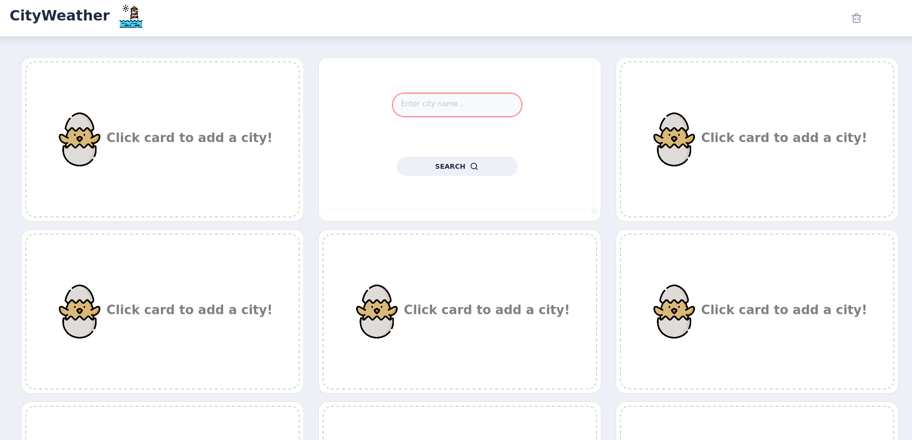
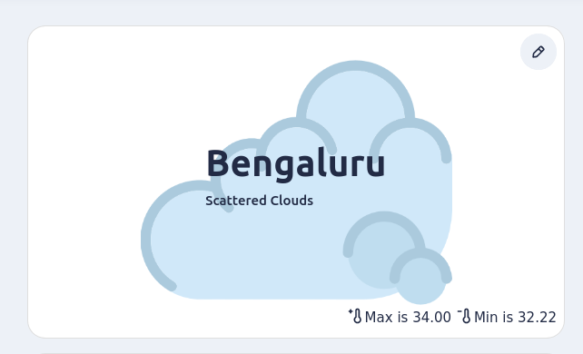
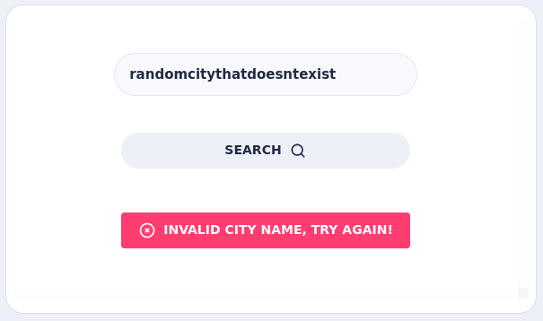
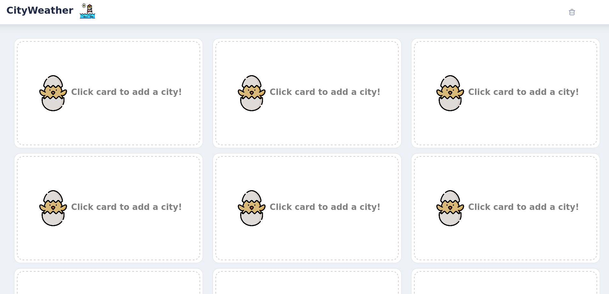
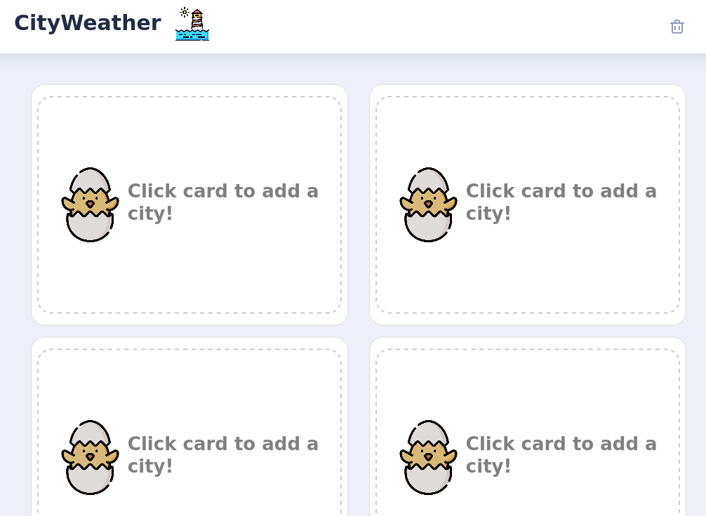
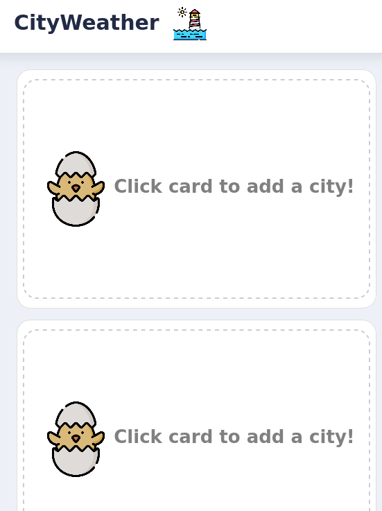
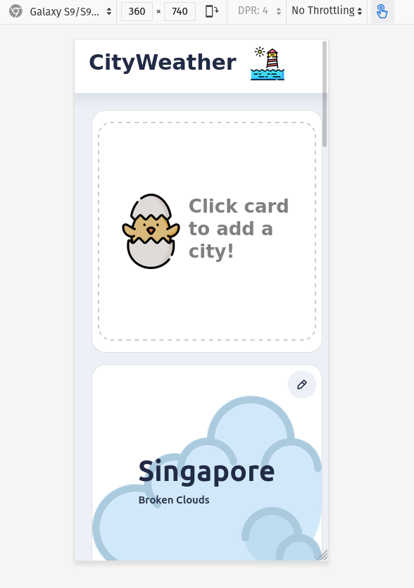
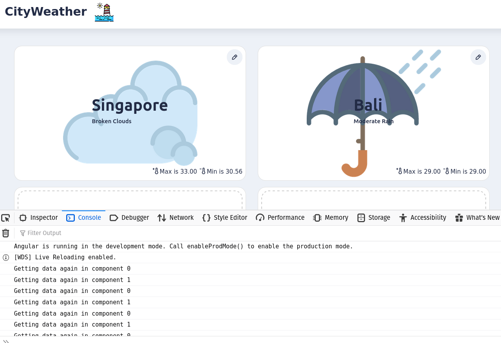
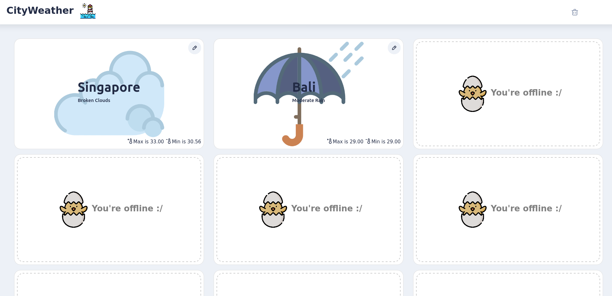

# CityWeather

> Tested on Firefox 75. Chrome does not allow loading `localhost` urls without an internet connection (weird, ik)
## Specification fulfillment overview
* 9 panels, with a text box appearing on click

* Edit button to modify city data shown on panel. Also, background picture in panel based on weather condition.

* Error displayed on wrong city name

* Responsive design

| Big size  | Medium size  | Small size  | Mobile  | 
|---|---|---|---|
|   |    |    |    | 
### Bonus:
* Data is updated every 10 seconds, only for components that have been initialized (as can be seen in the console logs)

* Offline usage. Last obtained weather data shown. (Even on page refresh). The user can see previous data, but can't query for more

## Development server

Run `ng serve` for a dev server. Navigate to `http://localhost:4200/`. The app will automatically reload if you change any of the source files.

## References :
* [card component](https://akveo.github.io/nebular/docs/components/card/overview#nbcardcomponent)
* [adding bootstrap to angular](https://www.smashingmagazine.com/2019/02/angular-application-bootstrap/)
* [bootstrap grid system](https://getbootstrap.com/docs/4.1/layout/grid/)
* [Openweather map api docs](https://openweathermap.org/current#current_JSON)
* [Angular Http client and json pipe for debugging](https://www.youtube.com/watch?v=_05v0mrNLh0&t=219s)
* [get input from input field](https://stackoverflow.com/questions/56203795/get-value-input-text-with-button-angular-7)
* [changing background image with ngStyle](https://stackoverflow.com/a/34875479)
* [topright of div](https://stackoverflow.com/questions/13114819/positioning-elements-at-top-right-of-div)
* [Use em instead of px for a responsive-fixed-height kinda situation](https://stackoverflow.com/questions/609517/why-em-instead-of-px)
* [Display inline stuff](https://stackoverflow.com/a/403149)
* [online-offline and indexdb handling](https://offering.solutions/blog/articles/2018/11/21/online-and-offline-sync-with-angular-and-indexeddb/)
* [Add new or update current entry with `put`](https://dexie.org/docs/Table/Table.put())
* [Get values from indexedDb table](https://dexie.org/docs/Table/Table.get())
* [Repeatedly calling stuff](https://stackoverflow.com/a/59101414)

This project was generated with [Angular CLI](https://github.com/angular/angular-cli) version 9.1.4.

